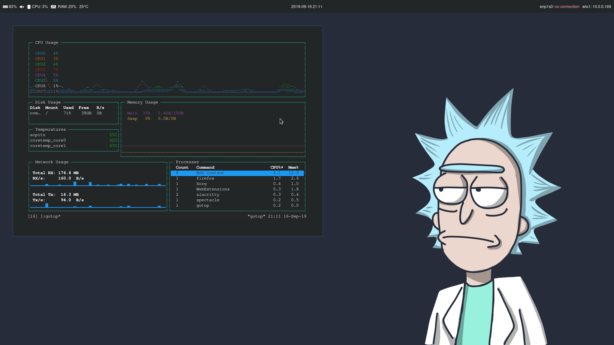
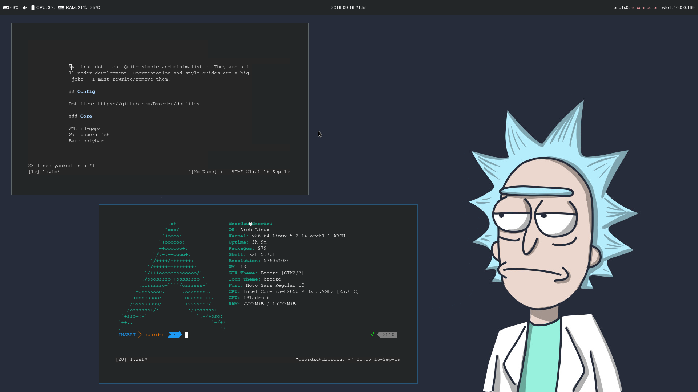
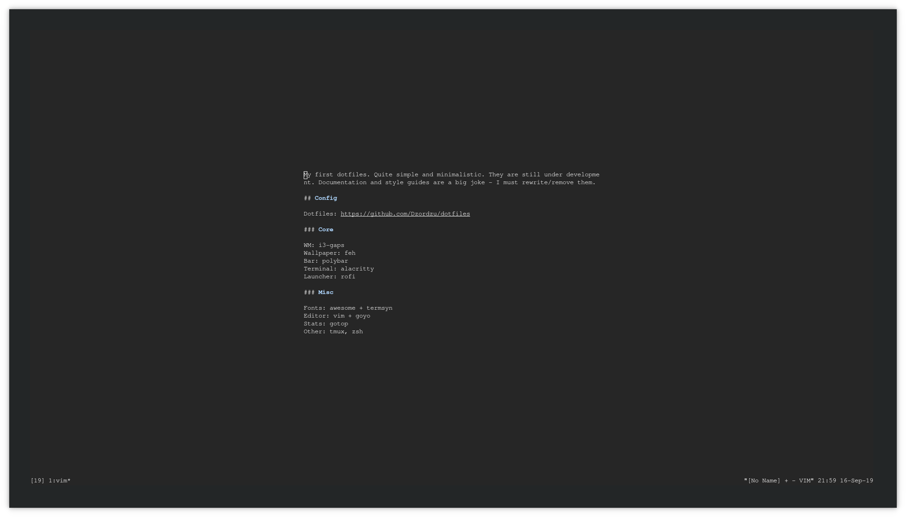

# dotfiles
Preconfigured dotfiles, configs and style guides for linux environment and apps

## Configs
- [vim](./docs/vim.md)
- [zsh](./docs/zsh.md)

## Style guide

- [hosts guide](./docs/hosts.md)
- [local user configs](./docs/local-user-configs.md)

## Screenshots

