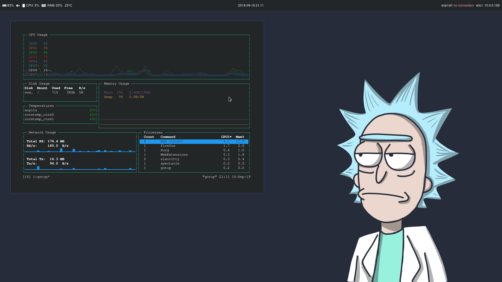
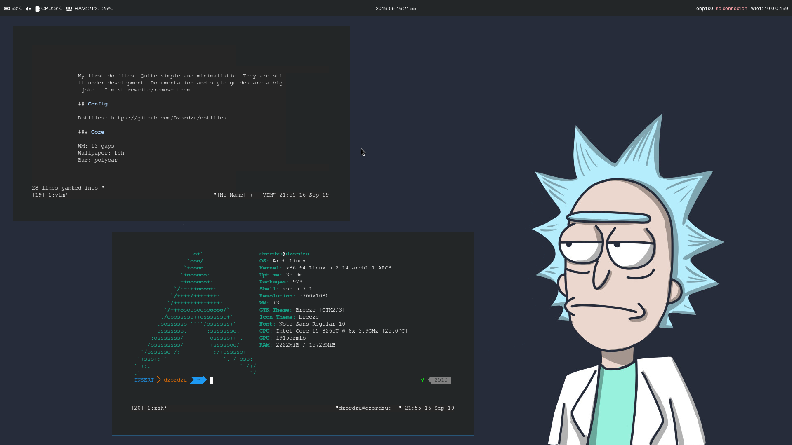
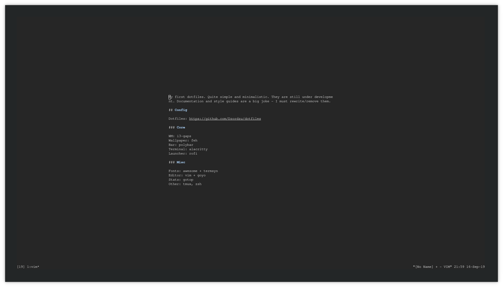

# dotfiles
Preconfigured dotfiles, configs and style guides for linux environment and apps

## Exported variables
- `$DOTFILES_DIR`

## Usage
### Setup a new environment
If you want a basic packages for the system use `df-prepare-system`. 

### Setup dotfiles
In order to setup dotfiles:

1. Install required packages `./df-install-packages`
2. Install dotfiles `./df-install-dotfiles full`
3. `source ~/.zshrc`

*Note: Once installed, dotfiles dir is prepended to $PATH (df_\* commands)*

## Customization
### Simple updates
Use standalone `df-install-dotfiles`
### Updates that require plugin installation
Use `df-install-dotfiles full`
### Choose theme
Use `df-choose-theme [THEME NAME]`

Currently supported:
1. `dark` **(default)**
2. `light`

## Configs
- [vim](./docs/vim.md)
- [zsh](./docs/zsh.md)

## Style guide

- [hosts guide](./docs/hosts.md)
- [local user configs](./docs/local-user-configs.md)

## Screenshots

